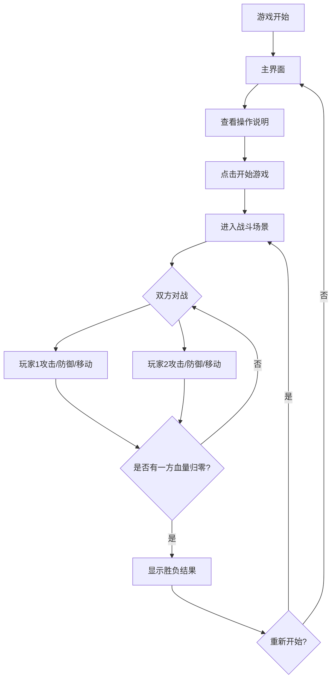

# 像素风机甲对战游戏 - 产品需求文档

## 1. 产品概述

一款复古像素风格的本地双人对战机甲格斗游戏，玩家操控各自的机甲进行对战，通过移动、攻击、防御等操作击败对手。

- **目标用户**：喜欢复古游戏风格、本地双人对战的玩家
- **核心价值**：简单易上手、快节奏对战、怀旧像素美学

## 2. 核心功能

### 2.1 游戏角色

| 角色 | 特点 | 初始血量 |
|------|------|----------|
| 机甲Alpha（玩家1） | 红色系，平衡型 | 100 HP |
| 机甲Beta（玩家2） | 蓝色系，平衡型 | 100 HP |

### 2.2 功能模块

1. **游戏主界面**：标题画面、开始按钮、操作说明
2. **战斗场景**：机甲对战区域、血量显示、状态信息
3. **结算界面**：胜负判定、重新开始选项

### 2.3 页面详情

| 页面名称 | 模块名称 | 功能描述 |
|----------|----------|----------|
| 主界面 | 标题区域 | 游戏标题、像素风格Logo |
| 主界面 | 操作说明 | 显示双方按键控制说明 |
| 主界面 | 开始按钮 | 点击进入战斗场景 |
| 战斗场景 | 竞技场 | 像素风格战斗背景 |
| 战斗场景 | 机甲角色 | 两个可操控的像素机甲 |
| 战斗场景 | 血量条 | 双方实时血量显示 |
| 战斗场景 | 状态提示 | 攻击、防御、受伤等状态 |
| 结算界面 | 胜负结果 | 显示获胜玩家 |
| 结算界面 | 重新开始 | 返回主界面或重新对战 |

## 3. 核心流程

### 3.1 游戏流程

1. 玩家打开游戏，进入主界面
2. 查看操作说明，点击开始按钮
3. 进入战斗场景，双方机甲就位
4. 玩家操控机甲进行移动、攻击、防御
5. 当一方血量归零时，游戏结束
6. 显示胜负结果，可选择重新开始

### 3.2 流程图

## 4. 用户界面设计

### 4.1 设计风格

- **主色调**：深色背景（#1a1a2e）配合霓虹色彩（红色#ff4757、蓝色#3742fa）
- **像素风格**：8-bit复古像素美学，方块化角色设计
- **字体**：像素字体（Press Start 2P），营造复古游戏氛围
- **布局**：横向对战布局，竞技场居中显示
- **动画**：攻击闪光、受伤闪烁、防御护盾效果

### 4.2 页面设计概览

| 页面名称 | 模块名称 | UI元素 |
|----------|----------|--------|
| 主界面 | 标题区域 | 大号像素字体标题，霓虹发光效果 |
| 主界面 | 操作说明 | 卡片式布局，分左右两栏显示双方按键 |
| 主界面 | 开始按钮 | 3D像素按钮，悬停放大效果 |
| 战斗场景 | 竞技场背景 | 网格地面、星空背景、边界线 |
| 战斗场景 | 机甲角色 | 32x48像素精灵，多帧动画 |
| 战斗场景 | 血量条 | 顶部横向血量条，渐变色彩 |
| 战斗场景 | 状态提示 | 浮动文字，攻击/防御图标 |
| 结算界面 | 胜负结果 | 大号文字，获胜者机甲展示 |
| 结算界面 | 重新开始按钮 | 双按钮布局（重新开始/返回主界面） |

### 4.3 操作控制

**玩家1（机甲Alpha - 左侧）**
- 移动：A/D 键（左右移动）
- 跳跃：W 键
- 攻击：F 键（近战攻击）
- 防御：G 键（按住防御）

**玩家2（机甲Beta - 右侧）**
- 移动：方向键 左/右（左右移动）
- 跳跃：方向键 上
- 攻击：K 键（近战攻击）
- 防御：L 键（按住防御）

### 4.4 响应式设计

- 桌面优先设计，推荐分辨率 1280x720
- 游戏画布固定比例 16:9
- 支持全屏模式

## 5. 游戏机制

### 5.1 战斗系统

| 动作 | 效果 | 冷却时间 | 伤害值 |
|------|------|----------|--------|
| 普通攻击 | 近战挥砍，前方范围伤害 | 0.5秒 | 15 HP |
| 防御 | 减免80%伤害，无法移动 | 无 | - |
| 跳跃攻击 | 跳跃中攻击，伤害加成 | 0.5秒 | 20 HP |

### 5.2 胜负条件

- 一方血量归零即判负
- 无时间限制
- 支持重新开始

## 6. 素材方案

### 6.1 像素素材

所有素材使用 CSS/Canvas 绘制，无需外部图片资源：

- **机甲精灵**：使用像素块绘制，包含站立、移动、攻击、防御、受伤5种状态
- **竞技场背景**：网格地面 + 星空背景
- **UI元素**：像素化按钮、血量条、图标

### 6.2 动画效果

- 机甲待机：轻微上下浮动
- 移动：腿部动画
- 攻击：武器挥动 + 攻击特效
- 防御：护盾光环
- 受伤：红色闪烁
