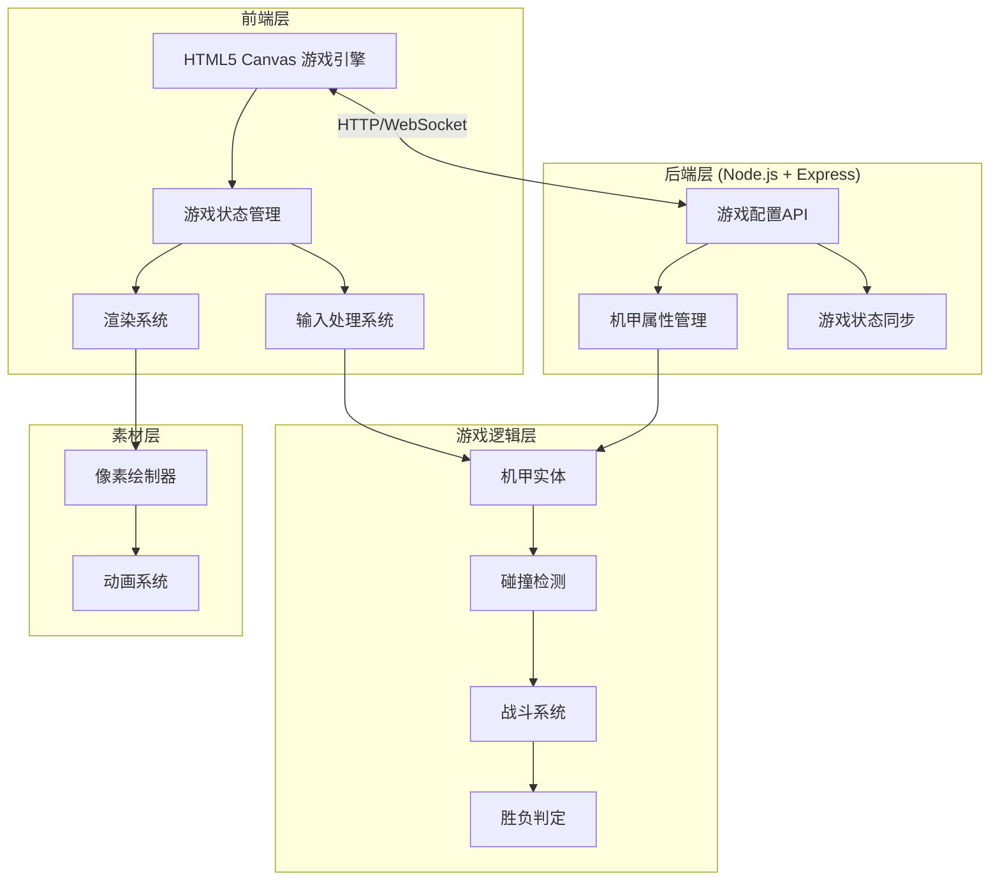
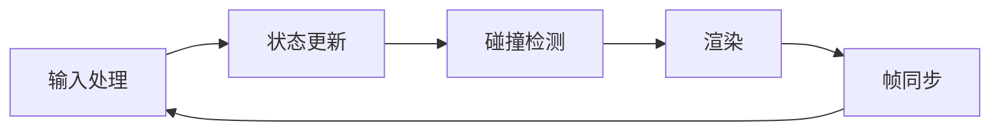

# 像素风机甲对战游戏 - 技术架构文档

## 1. 架构设计



## 2. 技术说明

- **前端框架**：原生 HTML5 + CSS3 + JavaScript（无框架依赖）
- **游戏引擎**：Canvas 2D API
- **后端框架**：Node.js + Express
- **通信方式**：RESTful API + 可选 WebSocket
- **构建工具**：无需构建，直接运行
- **数据存储**：内存存储（可扩展为数据库）

## 3. 文件结构

```
/workspace/
├── index.html          # 游戏主页面
├── styles.css          # 游戏样式
├── game.js             # 游戏主逻辑
├── server.js           # 后端服务
├── package.json        # 项目配置
└── .trae/
    └── documents/      # 设计文档
```

## 4. API 接口设计

### 4.1 游戏配置 API

| 方法 | 路径 | 描述 |
|------|------|------|
| GET | /api/config | 获取游戏配置 |
| PUT | /api/config | 更新游戏配置 |

### 4.2 机甲配置 API

| 方法 | 路径 | 描述 |
|------|------|------|
| GET | /api/mechs | 获取所有机甲配置 |
| GET | /api/mechs/:id | 获取指定机甲配置 |
| PUT | /api/mechs/:id | 更新指定机甲配置 |

### 4.3 游戏状态 API

| 方法 | 路径 | 描述 |
|------|------|------|
| POST | /api/game/start | 开始新游戏 |
| POST | /api/game/end | 结束游戏 |
| GET | /api/game/state | 获取游戏状态 |

## 5. 数据模型

### 5.1 游戏配置

```typescript
interface GameConfig {
    gravity: number;           // 重力加速度
    groundY: number;           // 地面Y坐标
    canvasWidth: number;       // 画布宽度
    canvasHeight: number;      // 画布高度
    attackCooldown: number;    // 攻击冷却时间(ms)
    jumpForce: number;         // 跳跃力度
    moveSpeed: number;         // 移动速度
}
```

### 5.2 机甲配置

```typescript
interface MechConfig {
    id: string;                // 机甲ID
    name: string;              // 机甲名称
    maxHealth: number;         // 最大血量
    attackDamage: number;      // 攻击伤害
    jumpAttackDamage: number;  // 跳跃攻击伤害
    defenseReduction: number;  // 防御减伤比例
    color: {                   // 颜色配置
        primary: string;
        secondary: string;
        accent: string;
    };
}
```

### 5.3 游戏状态

```typescript
interface GameState {
    isRunning: boolean;        // 游戏是否运行
    winner: string | null;     // 获胜者
    player1: MechState;        // 玩家1状态
    player2: MechState;        // 玩家2状态
    timestamp: number;         // 时间戳
}

interface MechState {
    x: number;
    y: number;
    health: number;
    isAttacking: boolean;
    isBlocking: boolean;
    isJumping: boolean;
}
```

## 6. 核心模块设计

### 6.1 游戏状态机

```javascript
const GameState = {
    MENU: 'menu',           // 主菜单
    PLAYING: 'playing',     // 游戏中
    PAUSED: 'paused',       // 暂停
    GAME_OVER: 'game_over'  // 游戏结束
};
```

### 6.2 机甲实体类

```typescript
interface Mech {
    x: number;              // X坐标
    y: number;              // Y坐标
    width: number;          // 宽度
    height: number;         // 高度
    velocityX: number;      // X方向速度
    velocityY: number;      // Y方向速度
    health: number;         // 当前血量
    maxHealth: number;      // 最大血量
    isFacingRight: boolean; // 朝向
    isAttacking: boolean;   // 是否正在攻击
    isBlocking: boolean;    // 是否正在防御
    isJumping: boolean;     // 是否正在跳跃
    isHurt: boolean;        // 是否受伤
    attackCooldown: number; // 攻击冷却
    color: string;          // 机甲颜色
}
```

### 6.3 输入处理

```typescript
interface InputState {
    left: boolean;    // 向左移动
    right: boolean;   // 向右移动
    jump: boolean;    // 跳跃
    attack: boolean;  // 攻击
    block: boolean;   // 防御
}
```

### 6.4 碰撞检测

- AABB（轴对齐边界框）碰撞检测
- 攻击范围检测
- 地面碰撞检测

## 7. 游戏循环



### 7.1 主循环伪代码

```javascript
function gameLoop(timestamp) {
    const deltaTime = timestamp - lastTime;
    
    handleInput();           // 处理输入
    update(deltaTime);       // 更新游戏状态
    checkCollisions();       // 碰撞检测
    render();                // 渲染画面
    
    requestAnimationFrame(gameLoop);
}
```

## 8. 渲染系统

### 8.1 像素绘制器

使用 Canvas 2D API 绘制像素风格图形：

- `drawPixelBlock(x, y, size, color)` - 绘制像素块
- `drawMech(mech)` - 绘制机甲精灵
- `drawHealthBar(x, y, width, health, maxHealth)` - 绘制血量条
- `drawBackground()` - 绘制背景

### 8.2 动画帧

机甲动画帧设计：

| 状态 | 帧数 | 动画效果 |
|------|------|----------|
| 待机 | 2 | 轻微上下浮动 |
| 移动 | 4 | 腿部交替移动 |
| 攻击 | 3 | 手臂挥动 |
| 防御 | 1 | 护盾光环 |
| 受伤 | 2 | 红色闪烁 |

## 9. 后端控制功能

### 9.1 可配置项

通过后端 API 可以动态调整：

1. **游戏参数**
   - 重力、移动速度、跳跃力度
   - 攻击冷却时间
   - 画布尺寸

2. **机甲属性**
   - 血量上限
   - 攻击伤害
   - 防御减伤比例
   - 外观颜色

3. **游戏状态**
   - 开始/结束游戏
   - 重置游戏状态

### 9.2 管理界面

后端提供简单的管理界面，可以：
- 查看当前游戏配置
- 实时修改游戏参数
- 查看游戏日志

## 10. 性能优化

- 使用 `requestAnimationFrame` 进行帧同步
- 避免每帧创建新对象
- 使用离屏 Canvas 缓存静态元素
- 限制最大帧率为 60 FPS
- 后端配置缓存

## 11. 扩展性设计

### 11.1 未来可扩展功能

- 添加更多机甲角色
- 添加技能系统
- 添加音效和背景音乐
- 添加 AI 对手
- 添加网络对战功能（WebSocket）
- 数据库持久化

### 11.2 模块化设计

- 输入系统独立模块
- 渲染系统独立模块
- 游戏逻辑独立模块
- 后端服务独立模块
- 便于后续扩展和维护
