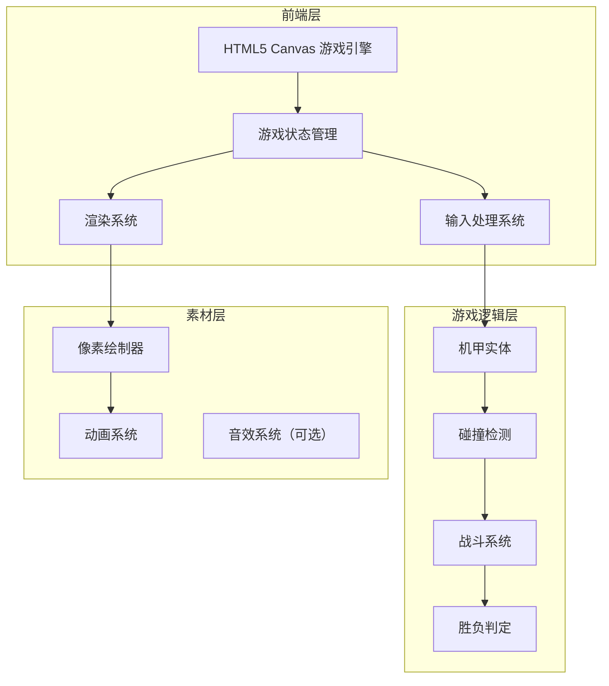

# 像素风机甲对战游戏 - 技术架构文档

## 1. 架构设计



## 2. 技术说明

- **前端框架**：原生 HTML5 + CSS3 + JavaScript（无框架依赖）
- **游戏引擎**：Canvas 2D API
- **构建工具**：无需构建，直接运行
- **后端**：无（纯前端本地游戏）
- **数据存储**：无（无持久化需求）

## 3. 文件结构

```
/workspace/
├── index.html          # 游戏主页面
├── styles.css          # 游戏样式
├── game.js             # 游戏主逻辑
└── .trae/
    └── documents/      # 设计文档
```

## 4. 核心模块设计

### 4.1 游戏状态机

```javascript
const GameState = {
    MENU: 'menu',           // 主菜单
    PLAYING: 'playing',     // 游戏中
    PAUSED: 'paused',       // 暂停
    GAME_OVER: 'game_over'  // 游戏结束
};
```

### 4.2 机甲实体类

```typescript
interface Mech {
    x: number;              // X坐标
    y: number;              // Y坐标
    width: number;          // 宽度
    height: number;         // 高度
    velocityX: number;      // X方向速度
    velocityY: number;      // Y方向速度
    health: number;         // 当前血量
    maxHealth: number;      // 最大血量
    isFacingRight: boolean; // 朝向
    isAttacking: boolean;   // 是否正在攻击
    isBlocking: boolean;    // 是否正在防御
    isJumping: boolean;     // 是否正在跳跃
    isHurt: boolean;        // 是否受伤
    attackCooldown: number; // 攻击冷却
    color: string;          // 机甲颜色
}
```

### 4.3 输入处理

```typescript
interface InputState {
    left: boolean;    // 向左移动
    right: boolean;   // 向右移动
    jump: boolean;    // 跳跃
    attack: boolean;  // 攻击
    block: boolean;   // 防御
}
```

### 4.4 碰撞检测

- AABB（轴对齐边界框）碰撞检测
- 攻击范围检测
- 地面碰撞检测

## 5. 游戏循环


### 5.1 主循环伪代码

```javascript
function gameLoop(timestamp) {
    const deltaTime = timestamp - lastTime;
    
    handleInput();           // 处理输入
    update(deltaTime);       // 更新游戏状态
    checkCollisions();       // 碰撞检测
    render();                // 渲染画面
    
    requestAnimationFrame(gameLoop);
}
```

## 6. 渲染系统

### 6.1 像素绘制器

使用 Canvas 2D API 绘制像素风格图形：

- `drawPixelBlock(x, y, size, color)` - 绘制像素块
- `drawMech(mech)` - 绘制机甲精灵
- `drawHealthBar(x, y, width, health, maxHealth)` - 绘制血量条
- `drawBackground()` - 绘制背景

### 6.2 动画帧

机甲动画帧设计：

| 状态 | 帧数 | 动画效果 |
|------|------|----------|
| 待机 | 2 | 轻微上下浮动 |
| 移动 | 4 | 腿部交替移动 |
| 攻击 | 3 | 手臂挥动 |
| 防御 | 1 | 护盾光环 |
| 受伤 | 2 | 红色闪烁 |

## 7. 性能优化

- 使用 `requestAnimationFrame` 进行帧同步
- 避免每帧创建新对象
- 使用离屏 Canvas 缓存静态元素
- 限制最大帧率为 60 FPS

## 8. 扩展性设计

### 8.1 未来可扩展功能

- 添加更多机甲角色
- 添加技能系统
- 添加音效和背景音乐
- 添加 AI 对手
- 添加网络对战功能

### 8.2 模块化设计

- 输入系统独立模块
- 渲染系统独立模块
- 游戏逻辑独立模块
- 便于后续扩展和维护
